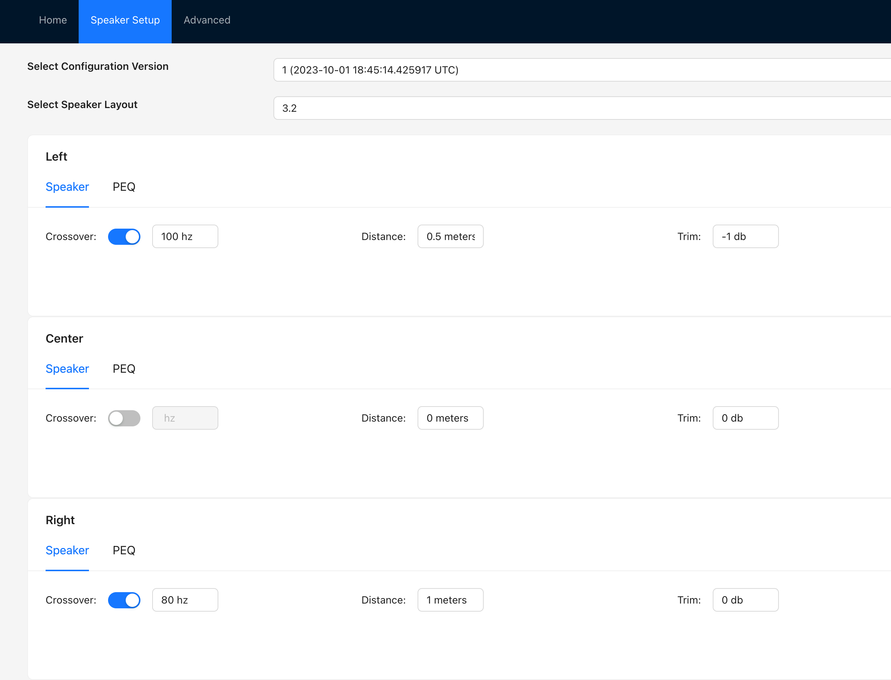
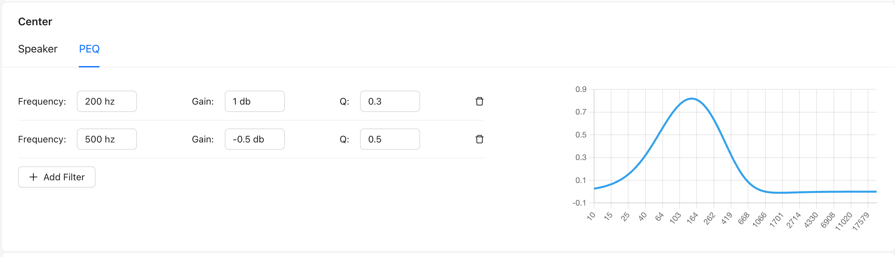
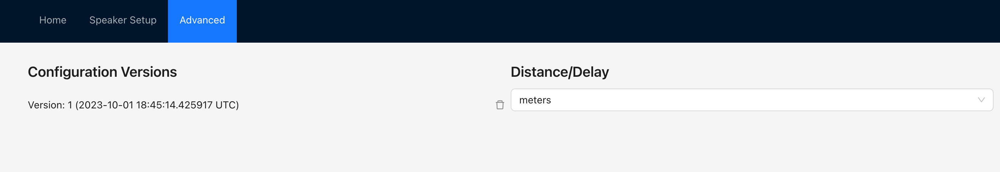

# Basic Server Commands

`cargo run`

Running local commands (assuming an appropriate json file; a "serialized" version of PorcessorSettings in [processor.rs](./src/processor.rs)).

`curl -X PUT http://127.0.0.1:8000/config -H 'Content-Type: application/json' -d @example_json.json`

`curl -X GET http://127.0.0.1:8000/config/latest`

Starting camilla:

`path/to/camilladsp -v -p1234 test.yaml`

Default port for camilla is `1234` in [main.rs](./src/main.rs).  This can be overridden by specifying the full websocket path to camilla as the first argument to the cli; eg `cargo run ws://127.0.0.1:4321`.    

# Generate SQL bindings to enable "offline" compilation

Install sqlx cli to enable rust to compile without a database.  This needs to be done after creating the tables so it can compile the binary and extract the metadata.
`cargo install --version 0.6.3 sqlx-cli`
`cargo sqlx prepare`
This creates the sqlx-data.json which allows the binary to be recompiled without the actual database existing.

# UI

The UI is scaffolded from create-react-app and is written in Typescript.  To run, `cd avprocessor-ui` and `npm start`.  Example screenshots:

# Workflow and architecture

The backend is a simple sqlite database.  There are five tables:
* `versions`, which holds the version ID, the version date, and the selected distance type for the speaker configuration (feet, meters, or raw milliseconds for the delays).  This table, when joined with `applied_version`, maps to the Rust struct `Version` and the Typescript interface `Version`.
* `applied_version`, which is a table with one row that contains the currently "selected" version which camilla is using.  Future enhancement: consider adding this as a boolean in the `versions` table.
* `filters`, which contains the filters per speaker per configuration.  This table maps to the Rust struct `Filter`, and to the Typescript interface `Filter` in the UI.  
* `speakers_settings_for_ui`, which mirrors the speaker "state" from the UI and tracks saved UI configuration.  This table maps to the Rust struct `SpeakerForUI`, and to the Typescript interface `Speaker` in the UI.
* `speakers_for_camilla`, which stores the configuration in a way that camilla can understand the settings.  In particular, it converts the distances in meters or feet into millisecond delays.  This table maps to the Rust struct `Speaker` and has no UI interface.

The computation for delays are relatively straightforward.  The longest distance speaker is taken as having 0 delay, and all other speakers are delayed relative to that speaker so that the sound hits the listener from all speakers simultaneously. 

# TODO

* Add docstrings to the relevant rust functions